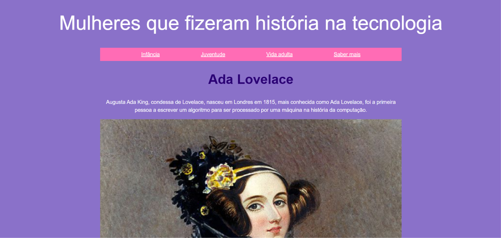

# Mulheres que fizeram história na tecnologia

## Sobre
O site criado tem o objetivo de visualizar a historia de vida de Ada Lovelace, uma mulher importante para o desenvolvimento da programação. Além disso, o site permite acessar a história de outras mulheres e enviar um formulário.

## Funcionalidades
- Responsivo
- Envio de formularios

## Tecnologias utilizadas
- HTML
- CSS
- JavaScript

## Pré-visualização

